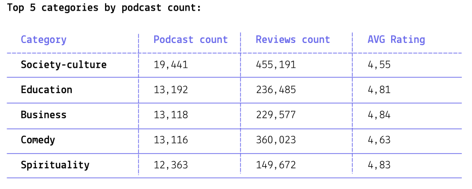
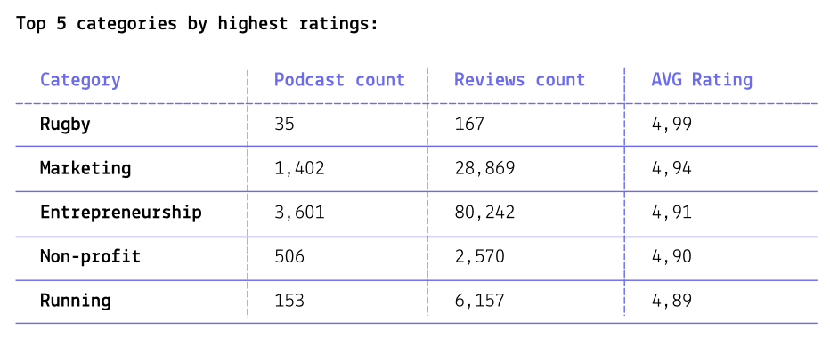
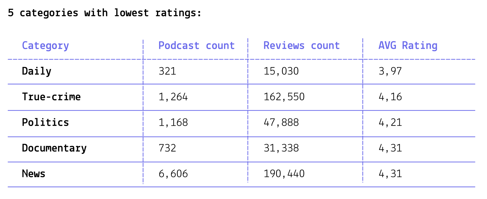
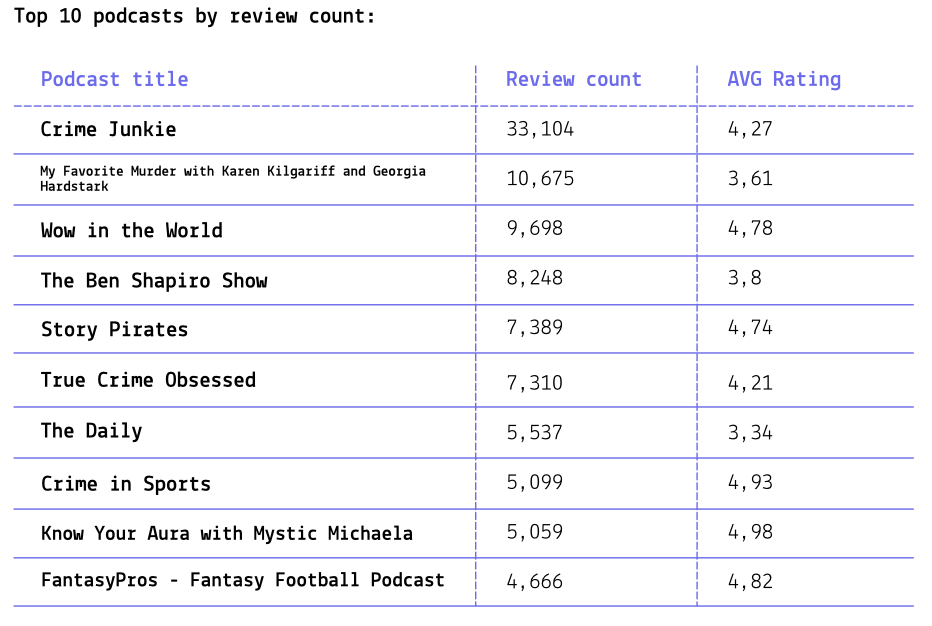
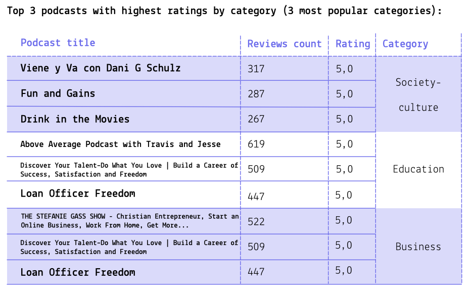

# 📊 Podcast Data Analysis (BigQuery SQL)

This project presents an analysis of podcasts database on BigQuery, using advanced SQL techniques for data cleaning, transformation, and complex dimensional aggregation. Datasets containing podcast information, categories, and user reviews were combined to reveal valuable insights.
The project includes several steps, including creation of database schema,  data cleaning, dimensional aggregation and relational data analysis.

## 🚀 Project Goals

The main goal was to explore podcast data to gather information on particular categories' and topics' popularity and ratings, top podcasts' performance in comparison of majority of content.

**Tasks:**
* **Database Design:** establishing a relational schema to explore the database structure.
* **Data Transformation (Unnesting):** initial data exploration showcased a common data quality issue: values in ‘category’ column of ‘categories’ table required cleaning by splitting denormalized, delimited string data (e.g., 'arts-sport-journal') into atomic rows.
* **Dimensional Analysis:** calculating aggregated metrics across transformed dimensions (podcast categories) using Common Table Expressions (CTEs) and appropriate JOIN types (LEFT JOIN vs. INNER JOIN) to ensure accurate and efficient results.
* **Gather Insights:** formulating insights based on results of analysis.
* **Formulate Suggestions to Stakeholders:** based on insights, formulate suggestion for possible improvements of podcasts' quality & popularity.

**Stakeholders:** `podcast platform`, `media researchers`, `podcast authors`.

## 💾 Database Structure

A database titled ‘podcast_reviews’ has three tables: ‘categories’, ‘podcasts’ and ‘reviews’. Tables can be connected through ‘podcast_id’.

**Dataset size:**
* ‘categories’ table has 212,372 rows
* ‘podcasts’ table has 110,023 rows
* ‘reviews’ table has 2,067,529 rows

## 🔎 Analysis questions

* ***Which podcast categories are most popular by the number of podcasts?***

SQL query to answer this question: [Categories by Podcast Count](sql/analysis/categories_by_count.sql)

* ***Which podcast categories have the highest average ratings?***

SQL query to answer this question: [Categories with Highest Ratings](sql/analysis/categories_by_rating.sql)

* ***Which podcast categories have the lowest average ratings***

SQL query to answer this question: [Categories with Lowest Ratings](sql/analysis/low_rating_categories.sql)

* ***What are top 10 podcasts by review count?***

SQL query to answer this question: [Top 10 Podcasts by Review Count](sql/analysis/top_10_by_review_count.sql)

* ***What 3 podcasts have highest ratings in top 3 most common categories?***

SQL query to answer this question: [Top 3 Podcasts in Business Category](sql/analysis/top_3_in_business_by_rating_and_reviews.sql)

## 📈 Insights of Analysis

**Podcast Popularity vs. Quality:**

* The most popular categories by number of podcasts like `society-culture`, `education`, and `business` all have relatively high podcast counts (13k to 19k) and massive review totals. However, their average ratings cluster tightly between **4.55** and **4.84**.

* In contrast, the categories with the highest ratings like `rugby`, `marketing`, and `entrepreneurship` have smaller podcast counts but their average ratings are much higher, starting at **4.89** and climbing to **4.99**.

* This means that there is a mix of high and low quality podcasts that leads to such average values in respective categories. The sheer volume of content in major categories leads to an averaging effect, where a high volume of lower-rated podcasts dilutes the score of the top performers. 

**Digest Content & Lowest Rating:**

* The categories with the lowest ratings are dominated by time-sensitive or high-volume content, indicating audience fatigue or less passionate reviews for general consumption. Content that is produced daily or covers sensitive, polarizing topics like `politics` or `true-crime` tends to pull down the overall average rating for these categories.

* The highest-volume podcast in the `daily` category has a very low rating of **3.34**, reinforcing the low average rating of the entire `daily` category (**3.97**).

**Top Podcasts Dominate the Review Landscape:**

The most popular podcast by review count, "Crime Junkie," has **33,104** reviews, which is more than three times the review count of the next podcast, "My Favorite Murder" (**10,675**). This shows that a few dominant market leaders control the vast majority of engagement in their segments.

**Cross-Category Performance:**

The presence of high-performing podcasts like 'Discover Your Talent...' and 'Loan Officer Freedom' in both the `education` and `business` categories illustrates that successful podcasts often bridge multiple popular categories to capture wider audience engagement.

## 🎯 Stakeholder Suggestions

**1. Optimize Acquisition Strategy for Niche Podcasts**

* The data clearly shows that audience satisfaction (average rating) peaks in niche categories despite lower podcast and review counts. It can be beneficial to relocate a portion of content acquisition or marketing investment from oversaturated, average-rated categories toward high-satisfaction, niche domains.

* Acquiring high-rated content in niche areas like `entrepreneurship` or `running` offers a higher return on engagement and increases the overall perceived quality of the platform's catalog.

**2. Implement Quality Control Measures**

* The lowest-rated categories are consistently those with high churn, sensitive, or polarized content, including `daily`, `politics`, and `true-crime`. The presence of market leaders with low ratings drags down the entire category score. To improve these categories' performance stricter content quality and consistency standards can be developed and implemented.

* Improving the floor rating of podcasts in these categories is critical. Stakeholders should investigate why high-volume podcasts fail to maintain quality, as this directly affects user retention in popular genres. In-depth reseach can be done to find out underperforming podcasts in each of these high-volume categories.

**3. Promote and Facilitate Cross-Categorization**

* The success of high-performing podcasts appearing in multiple popular categories demonstrates a powerful opportunity for audience growth and discoverability. Bridging categories helps capture different audience segments simultaneously. This is a low-cost mechanism to increase user engagement without requiring new content, by leveraging the existing multi-dimensional nature of successful shows.
